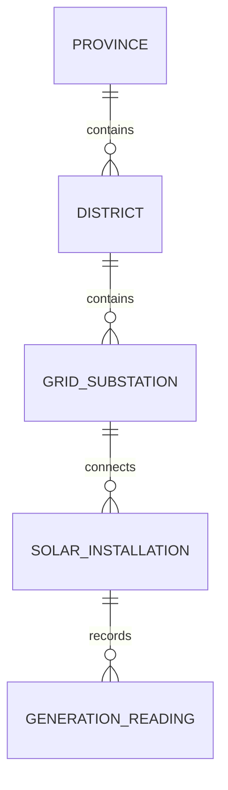

# Solar Generation Data Model — Conceptual Reference

This project reference describes domain entities and relationships independently of database fields and HTTP endpoints. See [architecture.md](architecture.md) for stored schemas and access design, and [API_DESIGN_RULES.md](API_DESIGN_RULES.md) for the HTTP contract.

Each child has one parent; a parent may have no children. An installation may have no readings. User is separate from the geographic hierarchy.

| Entity | Information |
| --- | --- |
| Province | Identifier, name |
| District | Identifier, province, name |
| GridSubstation | Identifier, district, name |
| SolarInstallation | Identifier, substation, unique meter/inverter identifier, status, device credential reference |
| GenerationReading | Identifier, installation, measurement time, instantaneous power (kW), cumulative energy (kWh), voltage, receipt time |
| User | Identifier, login identity, credential reference, role, read scope, optional regional assignment |

## Domain rules

- Meter identity belongs to the installation. A meter supplies readings for its own installation; users analyze data within their jurisdiction.
- User roles are `user` and `admin`. Regional users have a province or district assignment; admins have national scope without regional assignment. User has no active attribute.
- Installation status is `active` or `inactive`. Inactive installations retain their identity and history but cannot supply new readings; their meter identity remains reserved. They stay blocked until an admin explicitly reactivates them; reactivation preserves identity and history.
- Admins manage installation creation, deactivation, and removal of installations without readings. An installation with readings must be preserved. Removing an empty installation releases its meter identity; a replacement has a new identifier.
- Each reading is immutable. The latest measurement is derived from history.
- Cumulative kWh is a meter counter. Daily energy comes from counter changes with reset handling, rather than the sum of raw counter values.
