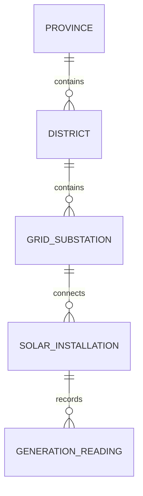

# Solar Generation Data Model — Conceptual Reference

This file describes the domain independently of the database and API. It is a separate reference, outside the project documentation.

Each child has one parent; a parent may have no children. An installation may have no readings. User is separate from the hierarchy.

| Entity | Information |
| --- | --- |
| Province | Identifier, name |
| District | Identifier, province, name |
| GridSubstation | Identifier, district, name |
| SolarInstallation | Identifier, substation, unique meter/inverter identifier, status, device credential reference |
| GenerationReading | Identifier, installation, measurement time, instantaneous power (kW), cumulative energy (kWh), voltage, receipt time |
| User | Identifier, login identity, credential reference, role (`user` or `admin`), read scope, optional province/district assignment for regional users; admins have national read scope without regional assignment; no active attribute |

- Meter identity is an installation attribute. The meter creates readings for its own installation; users read within their jurisdiction.
- Admin is a role on User, separate from the geographic hierarchy. It has national analyst read access to all geography, installations, readings, and derived views, plus installation creation, status updates to `inactive`, and hard deletion only when no readings exist. Its read scope is national with no regional assignment.
- Installation status is `active` or `inactive`. PATCH changes status without deleting the installation or history, and inactive status blocks device token issuance and new readings. Inactive meter identities remain reserved.
- Hard deletion is allowed only when no readings reference the installation, whether active or inactive. Preserve any installation that has readings; never cascade-delete history. Successful hard deletion releases the meter identity; a replacement installation receives a new identifier. Coordinate deletion with ingestion to prevent orphaned readings.
- Each reading is immutable. The latest measurement comes from the history, not a value stored on the installation.
- Cumulative kWh is a meter counter. Derive daily energy from counter changes, handling resets rather than summing raw counter values.
